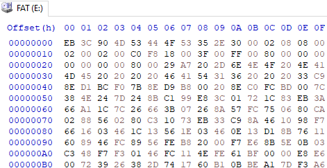
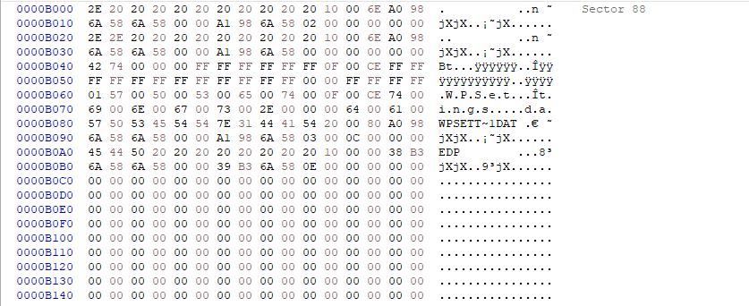
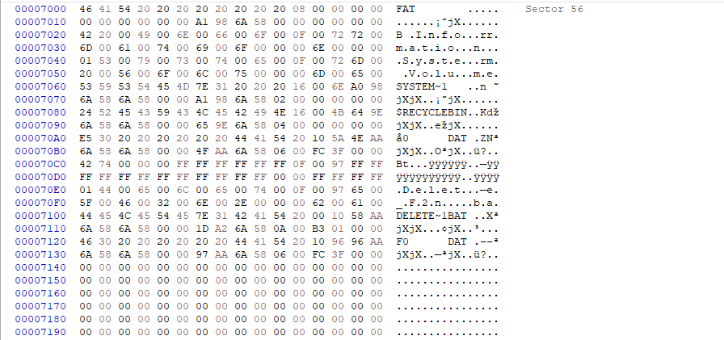
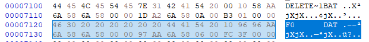
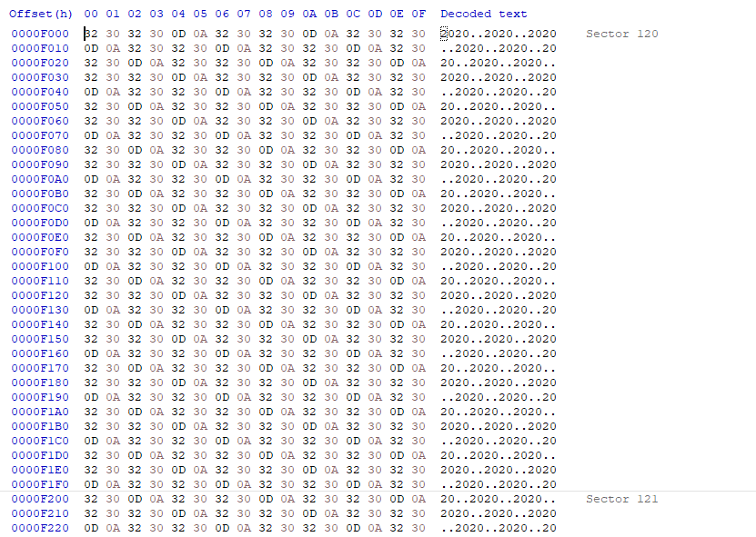

- Sector size:
    + Offset 0B(2B): 02 00h = 512B

- Cluster size(SC):
    + Offset 0D(1B): 08h = 8d sector

- Number of sector before FAT(SB)(Boot sector size):
    + Offset 0E(2B): 00 08h = 8d (sector)

- Number of FAT table(NF):
    + Offset 10(1B): 02h = 2d (table)

- RDET size(entry):
    + Offset 11(2B): 02 00h = 512d (entry)
    + RDET size(sector) (SR): 512*32/512 = 32 (sector)

- FAT table size(SF):
    + Offset 16(2B): 00 18h = 24d (sector)

- Volume size(SV):
    + Offset 13(2B): C0 00h = 49152d (sector)
    + Offset 20(4B): 00 00 00 00h = 0d 

- SS = SB + NF * SF + SR = 8 + 2 * 24 + 32 = 88 sector
=> DATA starts at sector 88
=> cluster 2 takes up 8 sectors => cluster n start at 88 + 8*(n-2)

RDET data: start at sector 56

2 files(Delete_F2n.bat and F0.dat)

Find the f0.dat location
Start cluster:
    + Upper part: offset 14(2B): 00 00h
    + Lower part: offset 1A(2B): 00 06h
=> 00000006h = 6 => F0.dat has the size of 4 clusters(prior) start at cluster 6 => cluster 6 starts at 88 + 8*(6-2) = 120.    
