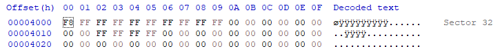

# Disk Header

- Sector size:
    + Offset 0B(2B): 02 00h = 512B

- Cluster size(SC):
    + Offset 0D(1B): 08h = 8d sector

- Number of sector before FAT(SB)(Boot sector size):
    + Offset 0E(2B): 00 08h = 8d (sector)

- Number of FAT table(NF):
    + Offset 10(1B): 02h = 2d (table)

- RDET size(entry):
    + Offset 11(2B): 02 00h = 512d (entry)
    + RDET size(sector) (SR): 512*32/512 = 32 (sector)

- FAT table size(SF):
    + Offset 16(2B): 00 18h = 24d (sector)

- Volume size(SV):
    + Offset 13(2B): C0 00h = 49152d (sector)
    + Offset 20(4B): 00 00 00 00h = 0d 

- SS = SB + NF * SF + SR = 8 + 2 * 24 + 32 = 88 sector
=> DATA starts at sector 88
=> cluster 2 takes up 8 sectors => cluster n start at 88 + 8*(n-2)

# RDET
RDET data: start at sector 56 (SB + NF * SF = 8 + 2 * 24)

# FAT
First FAT starts after Boot Sector: SB = 8 sector;
Second FAT starts at sector 32

# Delete and Recover

## Deleting Process
Before active the Delete_F2n.bat file to delete every files from F0.dat to F20.dat

Using File Explorer:

Using HxD to see RDET:

Using HxD to see FAT table:

Run Power Shell as administrator:

Use it to run Delete_F2n.bat and delete F0.dat

In File Explorer:

RDET in HxD:

FAT in HxD:

## Recover Process

Identify F0.dat in RDET:

Find F0.dat content:

    - Start cluster:
        + Upper word: offset 70B4(2B): 0000h
        + Lower word: offset 70BA(2B): 0005h
        => Start at cluster 00000005h = 5d
        => Cluster 5 starts at 88 + 8*(5-2) = sector 112.

This means that the content of the file is still there and will be able to be recovered.

Now close HxD and reopen the application as administrator

On the menu bar, choose "Tool" then press "Open disk..."

Open the FAT disk (remember to uncheck box "Open as Readonly")

Press "Ok":

Back to sector 56, rewrite the block at offset 70A0 from E5 back to 46.

Now go to sector 8 and change the FAT table, F0.dat takes up from offset 100A to 1011.
This is because F0.dat starts at physical cluster 11 and starts from logical cluster 5, so in offset 70AA, write 00 06, 00 07, 00 08 and EOF. 00 06 00 07 00 08 represents which clusters being used to stored F0.dat.

Rewrite the content

Do the same for the backup FAT at offset 32

Press Ctrl + S to save the disk. When the warning pop up, press yes to 

File F0.dat now being recovered

We can use Notepad to read the F0.dat content now.

